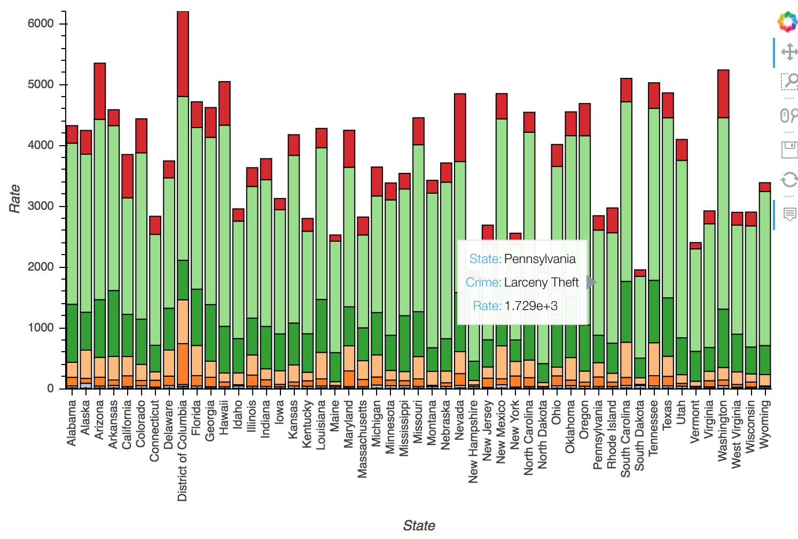

# data-viz-for-ds

We will approach data viz from the perspective of a data scientist.  Hopefully by the end of today you will understand a little bit about what data scientists need to use data visualization for, how they can most effectively use these tools, and how to think critically about visual communication.

## Goals

* Understand the difference between **Exploratory** and **Explanatory** visualizations
* Know which **visual encoding** best represent which **data types**
* Deconstruct a visualization into its component glyphs or marks.

I added the above plot example to this readme as an image because these interactive plots don't render correctly in the static notebook files.
